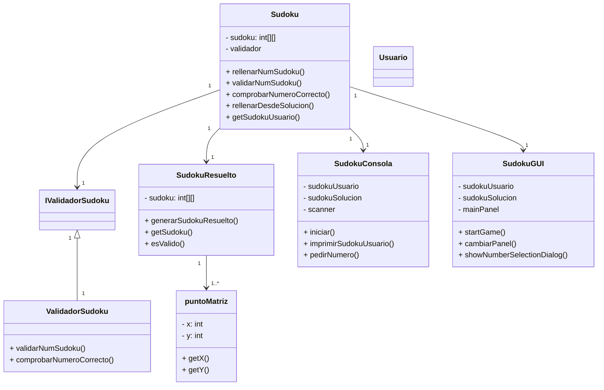

# Documentación UML del Proyecto Sudoku

## Diagrama de Clases UML



# Diagrama de Casos de Uso

```mermaid
flowchart TD
    Usuario --> |Seleccionar Dificultad| GenerarSudoku
    Usuario --> |Ingresar Número| ValidarEntrada
    Usuario --> |Ver Estado Juego| MostrarTablero
    Usuario --> |Finalizar Juego| Finalizar
    GenerarSudoku --> Sistema
    ValidarEntrada --> Sistema
    MostrarTablero --> Sistema
    Finalizar --> Sistema
````

# Matriz de Trazabilidad


| Requisito                                | Módulo / Clase                      | Métodos Clave                                     | Casos de Prueba                                           |
| ---------------------------------------- | ----------------------------------- | ------------------------------------------------- | --------------------------------------------------------- |
| **Requisitos Funcionales**               |                                     |                                                   |                                                           |
| RF1: Generar Sudoku resuelto             | `SudokuResuelto`                    | `generarSudokuResuelto()`, `esValido()`           | `testGenerarSudokuResuelto()`, `testEsValido()`           |
| RF2: Rellenar Sudoku con dificultad      | `Sudoku`                            | `rellenarDesdeSolucion()`                         | `testRellenarDesdeSolucion()`                             |
| RF3: Validar números ingresados          | `ValidadorSudoku`                   | `validarNumSudoku()`, `comprobarNumeroCorrecto()` | `testValidarNumSudoku()`, `testComprobarNumeroCorrecto()` |
| RF4: Ingresar número en celda            | `Sudoku`                            | `rellenarNumSudoku()`                             | `testRellenarNumSudoku()`                                 |
| RF5: Interfaz gráfica para jugar         | `SudokuGUI`, `GamePanel`            | `startGame()`, `processNumberSelection()`         | `testInteraccionGUI()` (manual/automatizado)              |
| **Requisitos No Funcionales**            |                                     |                                                   |                                                           |
| RNF1: Rendimiento adecuado en generación | `SudokuResuelto`                    | `generarSudokuResuelto()`                         | `testPerformanceGenerarSudoku()`                          |
| RNF2: Código modular y mantenible        | Todos (estructura)                  | Separación de clases y responsabilidades          | Revisiones de código, pruebas unitarias                   |
| RNF3: Interfaz amigable y responsiva     | `SudokuGUI`, `NumberSelectionPanel` | `cambiarPanel()`, `showNumberSelectionDialog()`   | `testUIResponsiveness()` (manual)                         |
